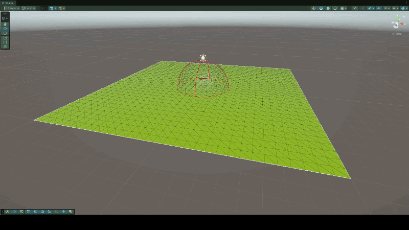
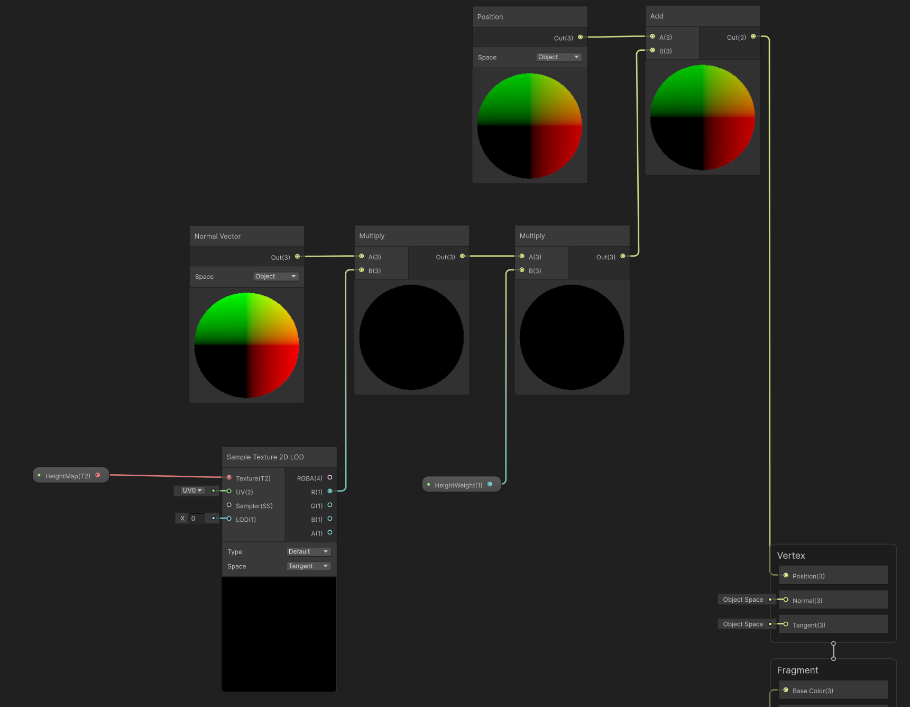
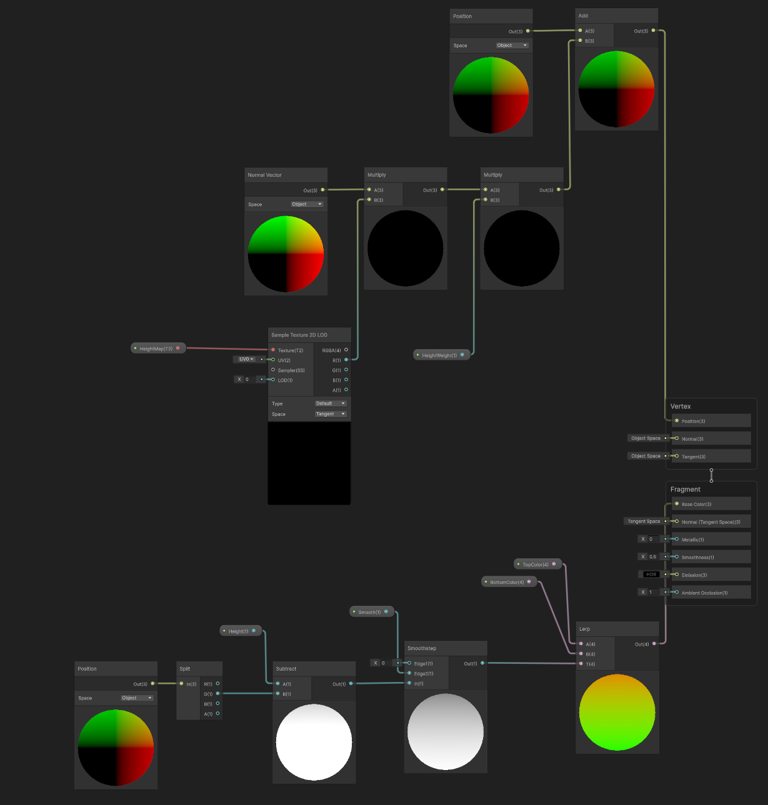

# PromvrTestTask

*\*На гифке наблюдаются шумы - последствия конвертации из видео*

*Для удобства поверх стеклянной сферы находится Gizmo сфера, красный цвет - накопление неактивно, синий - активно*

Используемая в проекте версия Unity: 6000.3.15f1 / URP

## Способ хранения материала и обновления Mesh

Материал хранится в одноканальной карте высот `RenderTexture`, текстура обновляется через вычислительный шейдер.

Обновление `Mesh` происходит в кастомном простом шейдере, созданном с помощью **ShaderGraph**, в нем же для удобства отображения есть логика изменения цвета в зависимости от высоты вершины.

Логика обновления положения вершин плоскости.

***Sample Texture 2D LOD** используется вместо обычного **Sample Texture 2D** потому что Unity не позволяет просто так брать данные из внешних загружаемых текстур (фактически народный костыль, чтобы обходить ограничения Unity, как обычно)*

Весь граф шейдера.

Далее: описание задания, а также примечания по его неточностям и итоговые реализованные решения. 

В конце: предложения по улучшению.

## Описание задачи

*\*Весь текст тестового задания перенесен из отправленного файла с заданием, ничего не изменено*

Тестовое задание: накопление материала на поверхности

Цель: реализовать в Unity механику накопления материала с изменением геометрии Mesh.

Запрещается! 
1. Сторонние готовые реализации генерации и деформации геометрии. Допускаются стандартные компоненты и пакеты Unity.
2. Создавать отдельные GameObject для порций материала

**Примечание:** *Не уточнено, нужно ли создавать без GameObject хранение порций материала. 
Фактически это будет просто список локальных карт высот.*

**Решение:** *В реализации порции не хранятся отдельно, используется одна общая карта высот.*

Описание механики:

На плоской поверхности находится полусферическая зона воздействия.

- Зона перемещается по поверхности с помощью WASD.

**Примечание/Решение:** *Для простоты используется старая система ввода, без считывая вертикальной и горизонтальной осей, только WASD.*

- Радиус зоны циклически изменяется во время выполнения по настраиваемой AnimationCurve.
- В пределах зоны материал постепенно накапливается снизу вверх. Активация накопления: Нажатие пробела.

**Примечание:** *Так как ранее упоминались порции, и ниже есть пункты про динамическое изменение скорости накопления, требуется уточнения по типу нажатия: удерживание, или повторное нажатие для деактивации.*

**Решение:** *В реализации для простоты используется система с нажатиями и флагом.*

- Скорость накопления задаётся в Inspector и не должна зависеть от FPS.

**Примечание/Решение:** *Все пункты связанные с независимостью от FPS и скорости можно было реализовать в FixedUpdate. Но обращение к вычислительному шейдеру в Unity оптимизировано для Update.
Поэтому просто работаем с передачей дельты времени и не теряем в скорости работы.*

- Материал постепенно накапливается снизу вверх в пределах текущей полусферической зоны. Скорость заполнения зависит от времени воздействия, а ранее накопленный материал сохраняется.

**Примечание1:** *Не уточнено, ограничивается только область по x и z или по высоте тоже. Ниже есть пункт про форму, поэтому исходя из этого принято следующее решение.*

**Решение1:** *В реализации также ограничивается высота формой сферы.*

**Примечание2:** *Также не уточнено как должна зависеть скорость от времени воздействия: все время пока активно заполнение, или пока сфера находится на месте.*

**Решение2:** *В реализации скорость увеличивается все время, пока активна текущая итерация заполнения (между нажатиями пробела). 
В инспектор дополнительно вынесен параметр коэффициента увеличения скорости накопления в секунду.*

- При движении зона должна оставлять непрерывный объёмный след.
- Повторные, параллельные и пересекающиеся проходы должны суммироваться в общей геометрии.
- Изменение или перемещение зоны не должно удалять либо уменьшать ранее накопленный материал. Полусфера ограничивает только добавление нового материала.
- Материал должен добавляться по всей траектории между предыдущим и текущим положением зоны, без разрывов при высокой скорости перемещения или низкой частоте кадров.

**Примечание/Решение:** *На стороне GPU реализована проверка всего следа, состоящего из двух положений сфер (с учетом изменения радиуса) и трапеции между ними - 2D-форма скругленного конуса.*

- Изменение радиуса зоны должно влиять на ширину и форму создаваемого следа.

Настраиваемые параметры:
- скорость перемещения зоны;
- базовый радиус;
- амплитуда и частота изменения радиуса;
- AnimationCurve изменения радиуса;

**Примечание/Решение:** *4 параметра выше находятся на контроллере сферы, 1 ниже находится на контроллере карты высот (пункт про SOLID).*

- скорость накопления материала;

Технические требования:
- Поверхность может быть представлена регулярной сеткой и height map.

**Примечание/Решение1:** *Т.к. управление параметрами стандартной плоскости в Unity ограничено, а также из-за того, что у нее инвертированные UV-координаты (да-да, спасибо Unity) - 
дополнительно написан генератор кастомной квадратной плоскости, с указанием размера стороны и количества вершин на сторону, сетка создается так же в отдельном вычислительном шейдере.
Высчитываются положения вершин, нормали (все вверх), UV-координаты, треугольники. На стороне CPU пересчитываются касательные и границы.*

**Примечание/Решение2:** *В целях ускорения, реализован метод отрисовки геометрии сетки сразу на GPU через `Graphics.DrawMesh`.
Передача параметров в материал через `MaterialPropertyBlock` (исключаем неявное пересоздание материала Unity).
Дополнительно получаем прибавку к скорости работы. Для отладки в редакторе предусмотрен режим отрисовки сетки с помощью стандартных `MeshFilter` и `MeshRenderer`.*

- Состояние накопленного материала должно храниться отдельно от отображающего Mesh.

**Решение:** *Хранится в карте высот.*

- Должна быть возможность сбросить поверхность.

**Примечание:** *В задании не указано каким действием должен вызываться данный функционал.*

**Решение:** *Реализован сброс карты высот по клику на Backspace.
Дополнительно - если накопление было активировано во время сброса - накопление отключается и текущая скорость сбрасывается до базовой.*

- При непрерывной работе не должно возникать постоянных аллокаций памяти.

**Решение:** *Решено работой с единственной текстурой, редактируемой на стороне GPU.*

Общие требования, при выполнении задания:
- Код  должен быть читабельным, легко расширяемым и лаконичным.
- Неочевидные алгоритмические решения должны быть кратко прокомментированы.
- Соблюдение базовых принципов SOLID и КОП.
- Внимание к деталям, аккуратность, вовлечённость и инициатива.

Результат.
Необходимо предоставить:

1. Unity-проект в Git-репозитории с последовательной историей содержательных коммитов. *(+)*
2. Короткое видео работы; *(+ Заменено на гифку, по причине отсутствия поддержки видео в GitHub)*
3. Краткое описание способа хранения материала и обновления Mesh; *(+)*
4. Фактически затраченное время; *(+ Обозначено в переписке с hr)*
5. Описание основных ограничений решения. *(+ Особых ограничений нет, все параметры ограничиваются в коде)*
6. \*Предложения по улучшению варианта реализации (будет плюсом) *(+ следующий раздел)*

## Предложения по улучшению

**1.** Для нормального SOLID и в реалиях серьезного проекта следует управлять зависимостями между объектами через средства DI, например Zenject или VContainer.

**1.1** Для событий лучше использовать например MessagePipe, дополнительно ускорится проект.

**2.** При генерации плоскости можно избежать изначального выделения памяти под массивы данных сетки.
Для этого можно пометить буфферы вершин и треугольников меша, как буфферы сырых данных, и работать на стороне HLSL напрямую с `RWByteAdressBuffer` вместо обычного `RWStructuredBuffer`
через функции `Load`/`Store` и вычислением шага буффера в байтах (стоит помнить, что для такого функционала требуется наличие версии DirectX 12). Кроме отсутствия затрат на выделение памяти еще и получится прирост в производительности.

**2.1** Для того, чтобы не генерировать детальные плоскости лучше использовать возможности HDRP и добавить в шейдер плоскости функцию тесселяции. 
Либо вне HDRP вручную написать кастомный шейдер с тесселяцией (стоит помнить, что для такого функционала требуется целевая версия шейдера не ниже 4.5). Так дополнительно получим прибавку в скорости работы.

**3.** Полностью перенести вычисления по накоплению материала из вычислительного шейдера, в шейдер отображения, текущий HLSL код несложно преобразовать в кастомные функции и интегрировать в **ShaderGraph**.
Так получим еще более весомую прибавку в скорости работы, при условии, что передавать параметры в шейдер материала исключительно через `MaterialPropertyBlock` (как в данный момент реализовано в контроллере плоскости).

**3.1** Использовать либо несколько функций под разные формы, либо задавать в шейдер маску формы, чтобы генерировать накопления материала разных форм.

**4.** Код управления картой высот правильнее перевести на состояния, архитектура станет прозрачнее.

**5.** В HLSL функциях использовать меньше переменных, код станет менее читаемым, но более производительным.
